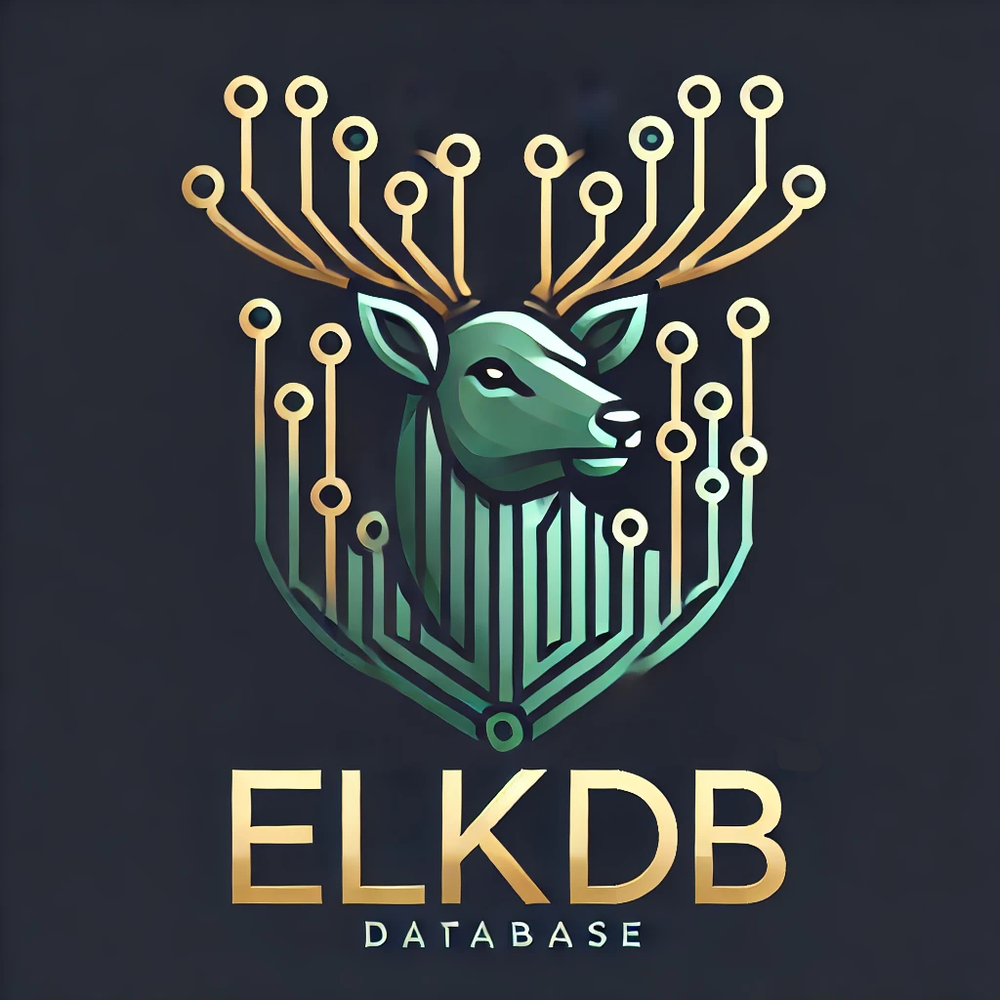

# ElkDB (WIP)

ElkDB is a database system written from scratch in go.

## Features
| Feature                                         | Status |
|-------------------------------------------------|--------|
| B-tree implementation                           | ✔️     |
| Page persistence management                     | ✔️     |
| Metapage management                             | ✔️     |
| Key-value storage                               | ✔️     |
| Page free list implementation                   | ✔️     |
| Table implementation                            | ✔️     |
| Meta table management                           | ✔️     |
| Secondary indexing                              | ❌     |
| Transactions                                    | ❌     |
| SQL Parser                                      | ❌     |
| SQL executor                                    | ❌     |
