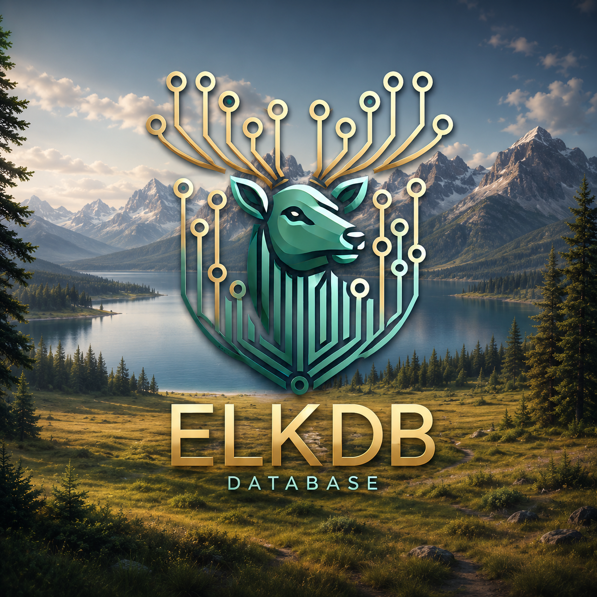

# ElkDB

ElkDB is a relational database built from scratch. It is designed as a learning and reference implementation: every layer — from raw page storage up to SQL parsing and a TCP network protocol — is written without external dependencies. 

<div align="center">

</div>


---

## Features

- Copy-on-write B-tree with MVCC snapshot isolation
- Durable, crash-safe page storage over a memory-mapped file
- Versioned free page list with safe concurrent-reader reclamation
- Read-write and read-only transactions with serialisable writes
- Relational table layer with primary keys, secondary indexes, and schema persistence
- SQL-like query language supporting CREATE TABLE, INSERT, UPSERT, UPDATE, DELETE, and SELECT with WHERE
- Binary network protocol (ElkWire) for client-server communication
- Go SDK for embedding database access in any application
- Interactive REPL supporting both local (embedded) and remote (server) modes

---

## Internal Architecture

The codebase is organised as a strict dependency stack. Each layer knows only about the layer directly below it; nothing reaches upward.

```
queries/      SQL parser and executor
tables/       relational schema, encoding, index management
kv/           transactional key-value store, pager, mmap
btree/        copy-on-write B-tree, free list
network/      ElkWire protocol, server, client SDK
cmd/          binary entry points
```

### B-tree (`btree/`)

The foundation of ElkDB is a copy-on-write B-tree. Nodes are fixed-size 4096-byte slices that map directly to on-disk pages — there is no serialisation step because a node in memory is exactly the bytes that will be written to disk.

Every mutation (insert, update, delete) traverses the tree top-down, allocates new nodes along the modified path, and never touches existing nodes. Old nodes are handed to the free list for eventual reclamation. This means every version of the tree remains readable until no transaction holds a reference to it, which is the property that makes MVCC possible.

The tree supports three insert modes: insert-only (fails if the key already exists), update-only (fails if the key does not exist), and upsert (always succeeds). Range scans are supported via an iterator that walks the leaf level in key order. Internal nodes carry only keys and child pointers; values are stored exclusively in leaf nodes.

Node splitting and merging are handled automatically. A node that overflows a page is split into up to three nodes; a node that falls below a quarter of a page is merged with a sibling. The root is collapsed when it becomes an internal node with a single child.

The B-tree has no knowledge of files, memory maps, or transactions. It interacts with storage exclusively through a `PageStore` interface with three methods: read a page, allocate a new page, and mark a page as freed. The KV layer injects its transaction as the concrete implementation.

Keys are limited to 1000 bytes and values to 3000 bytes, ensuring that a single key-value pair always fits within one page.

### Free Page List (`btree/`)

When a write transaction frees a page it cannot immediately be reused, because a concurrent read transaction may still be reading from it. The free list tracks which pages have been freed and at which transaction version, and only makes a page available for reuse once no active reader holds a snapshot older than that version.

The list itself is stored on disk as a linked list of pages in the same file, using the same 4096-byte page format as B-tree nodes. Each free-list node records a batch of freed page numbers alongside the transaction version at which they were freed. The free list is updated atomically as part of every commit.

When the list needs to write new nodes to record freshly freed pages, it first tries to recycle free-list nodes that are themselves old enough to be reused. This self-recycling loop keeps the on-disk footprint of the free list stable under steady-state workloads.

The minimum active reader version is tracked through a min-heap of all open read transactions. On every write transaction begin, this minimum version is passed to the free list so it knows the reclamation boundary.

### Pager and Memory-Mapped I/O (`kv/`)

The KV layer owns the file and its memory mapping. On open, the file is mapped with `mmap` using `MAP_SHARED`, which means writes to the mapped region are visible to the OS page cache without a separate `write` syscall. When the database grows beyond the current mapping, an additional mapping is appended rather than remapping the whole file; this preserves the validity of pointers held by active read transactions.

The first page of the file is reserved as the master page. It contains a fixed-size header with the database signature, the root page number of the B-tree, the total number of allocated pages, the head of the free list, and the current transaction version. This is the single authoritative record of the database state and the atomic commit point.

File growth is managed with `fallocate`, which pre-allocates disk space in geometric increments to amortise the cost of growth. The mmap is extended separately from the file to maintain the invariant that the mapped region is always at least as large as the live portion of the file.

### Transactions (`kv/`)

ElkDB supports two transaction kinds: read-only snapshots (`KVReader`) and read-write transactions (`KVTX`).

A read-only transaction captures the current B-tree root and the current mmap chunk list at the moment it is opened. All subsequent reads within the transaction see exactly this snapshot, regardless of concurrent writes. The transaction is registered in the reader heap so the free list knows it is active.

A read-write transaction acquires a mutex on open, ensuring there is at most one writer at any time. It operates on an in-memory update map: new and modified pages are buffered in a `map[uint64][]byte` and are not written to the mmap until commit. Reads within the transaction check this buffer first and fall back to the mmap for pages that have not been modified. Freed pages are recorded with a `nil` entry and handed to the free list at commit time.

Commit proceeds in two phases. First, all modified pages are written into the mmap (which has been extended if necessary) and an `fsync` is issued to ensure the page data reaches disk. Second, the master page is rewritten atomically and a second `fsync` is issued. If the process crashes between the two fsyncs, the master page still points to the previous consistent state and the database is intact. If it crashes after the second fsync, the new state is durable. There is no write-ahead log; durability is achieved entirely through the two-phase master-page update.

Aborting a transaction simply discards the in-memory update map and releases the writer mutex. Because nothing was written to disk, abort is instantaneous and infallible.

### Key-Value Store (`kv/`)

The KV layer exposes a simple get/update/delete interface over the B-tree. It is not used directly by application code; the tables layer sits on top of it and provides the relational abstraction.

### Tables and Schemas (`tables/`)

The tables layer builds a relational model on top of the key-value store. Each table has a named schema (`TableDef`) recording column names, column types, the number of leading primary-key columns, and any secondary indexes. Schemas are stored in a reserved system table (`@table`) as JSON-encoded values, making them durable and transactional like all other data.

ElkDB supports two column types: 64-bit signed integers (`TypeInt64`) and variable-length byte strings (`TypeBytes`). Rows are encoded as ordered byte keys using a type-preserving encoding: integers are bias-encoded so their unsigned byte representation is sort-order-compatible with their signed value; byte strings are null-terminated with an escape scheme that preserves order even when the data contains null bytes.

Primary keys are formed by encoding the primary-key columns in declaration order. This encoding is stored as the B-tree key; the remaining non-key columns are stored as the B-tree value.

Secondary indexes are implemented as additional B-tree entries whose keys encode the indexed columns concatenated with the primary key (to ensure uniqueness). Index entries contain no value data; a lookup on a secondary index returns a primary key which is then used to fetch the full row.

Table definitions are cached in memory after their first access. The cache is protected by a mutex and is consistent with the underlying B-tree: a schema read within a transaction always sees the schema as of that transaction's snapshot.

Range scans expose a `Scanner` abstraction that wraps the B-tree iterator. The scanner can be positioned with comparison operators (greater-than, greater-than-or-equal, less-than, less-than-or-equal) on a partial primary key.

### Query Language (`queries/`)

The query layer provides a SQL-like interpreter. It consists of a lexer, a recursive-descent parser, an AST, and an executor that maps AST nodes to table operations.

#### Supported Statements

**CREATE TABLE** defines a new table with a list of column definitions, a primary key column count, and an optional list of secondary index definitions.

**INSERT** adds a new row. Fails silently (returns affected = 0) if the primary key already exists.

**UPSERT** inserts a new row or replaces an existing one with the same primary key. Reports affected = 1 when a new row is created, affected = 0 when an existing row is replaced.

**UPDATE** modifies columns of existing rows matching the WHERE clause using SET assignments. Assignments can reference column values and arithmetic expressions.

**DELETE** removes rows matching the WHERE clause.

**SELECT** returns rows from a table, optionally filtered by a WHERE clause and projected to a named column list or `*`. When the WHERE clause is a simple comparison on the first primary-key column, the executor pushes it down into a B-tree range scan. All other filtering is applied in memory after the scan.

#### WHERE Expressions

WHERE accepts binary expressions with comparison operators (`==`, `!=`, `<`, `<=`, `>`, `>=`) and arithmetic operators (`+`, `-`, `*`, `/`). Operands may be integer literals, single-quoted string literals, or column references.

#### Session and Statement Streaming

A `Session` wraps a database handle and a `StmtSplitter` that buffers partial input and emits complete semicolon-terminated statements. This allows callers to feed text in arbitrary chunks (e.g. line by line from the REPL or in full from the network handler) without managing parse state themselves.

Each statement is executed in its own transaction. Read-only statements (SELECT) use a read-only transaction; all others use a read-write transaction. Results are returned as a slice of `Result` values, one per completed statement.

---

## Network Protocol (ElkWire)

ElkDB includes a binary network protocol called ElkWire, enabling client applications to connect to a running server over TCP and execute queries remotely. The server opens one `Session` per connection; connections are fully isolated from one another.

### Frame Layout

Every message in both directions uses the same fixed-size frame header:

```
┌──────────┬──────────┬────────────┬──────────────────┐
│ MsgType  │ ReqID    │ PayloadLen │ Payload          │
│ 1 byte   │ 4 bytes  │ 4 bytes    │ PayloadLen bytes  │
└──────────┴──────────┴────────────┴──────────────────┘
```

All multi-byte integers are big-endian. The `ReqID` field is a monotonically increasing counter assigned by the client and echoed in the server's response, which provides a foundation for future pipelining without changing the frame format.

### Message Types

| Direction        | Type     | Code   | Purpose                          |
|------------------|----------|--------|----------------------------------|
| Client → Server  | Query    | `0x01` | Execute a SQL string             |
| Client → Server  | Ping     | `0x02` | Liveness check                   |
| Server → Client  | Result   | `0x81` | Successful query result          |
| Server → Client  | Error    | `0x82` | Query or protocol error          |
| Server → Client  | Pong     | `0x83` | Ping response                    |

### Query Payload

The Query payload begins with a flags byte, followed by a 4-byte SQL string length, followed by the SQL string bytes. The only defined flag is `FlagReadOnly` (bit 0), which is set automatically by the client when the query begins with `SELECT` and allows the server to open a read-only transaction.

### Result Payload

The Result payload encodes the affected-row count and the full set of returned rows. Column names and type tags are included with each row, making each result self-describing without requiring a separate schema negotiation step. Integer values are encoded as 8-byte big-endian signed integers; byte string values are encoded as a 4-byte length prefix followed by raw bytes.

### Error Payload

The Error payload is a 4-byte length-prefixed UTF-8 string containing the error message from the database engine. Any error that would be returned by `Session.ExecChunk` — including parse errors, type errors, missing tables, and constraint violations — is transmitted as an Error frame rather than closing the connection. The connection remains usable after an error.

---

## Go SDK

The `network` package doubles as the client SDK. Any Go application can import it and connect to a running ElkDB server with three lines of setup.

The central type is `Conn`, obtained by calling `Dial` with the server address. `Conn` exposes two methods: `Exec`, which sends a SQL string and returns a `Result`, and `Ping`, which verifies the connection is alive. `Result` carries an `Affected` count for write statements and a `Rows` slice for SELECT statements; each row is a `table.Record` with named columns and typed values.

The protocol is currently synchronous: each `Exec` call sends one request and waits for one response before returning. This keeps the SDK simple and correct; pipelining can be layered on top in a future version without changing the frame format.

### Example Application

The following sketch shows a Go program that connects to an ElkDB server, creates a table, inserts a few rows, and queries them back. It uses only the `network` package and the `tables` package for type constants — no other ElkDB internals are needed.

The program dials the server, checks reachability with a ping, issues a `CREATE TABLE` statement, inserts three rows, and then runs a `SELECT` to retrieve all of them. Each returned row is a `table.Record`; the program iterates over its `Cols` and `Vals` slices to print column names and values. Integer values are accessed through the `I64` field; byte string values through the `Str` field. The type of each value is indicated by its `Type` field, which is one of `table.TypeInt64` or `table.TypeBytes`.

---

## Running ElkDB Locally

### Start the server

```
./elkdb-server
```

### Connect with the interactive REPL

Local mode opens the database file directly without a server:

```
./elkdb
```

Remote mode connects to a running server:

```
./elkdb -remote localhost:5433
```

## Running ElkDB with Docker

Pull the latest image:

```bash
docker pull ghcr.io/MHS-20/elkdb:latest
```

Run with a named volume so your data survives container restarts:

```bash
docker run -d \
  -p 5433:5433 \
  -v elkdb-data:/data \
  --name elkdb \
  ghcr.io/MHS-20/elkdb:latest
```

Then connect with the CLI:

```bash
./elkdb -remote localhost:5433
```

> **Data** is stored in the `/data` volume. To back it up, copy `/data/elkdb.db` out of the container:
>
> ```bash
> docker cp elkdb:/data/elkdb.db ./elkdb.db
> ```
>
---

## Limitations

- A single write transaction runs at a time. Concurrent read throughput is unlimited; write throughput is limited to one transaction per commit cycle.
- The SQL WHERE clause only pushes down simple comparisons on the first primary-key column into the B-tree range scan. Filtering on non-key columns is applied in memory after a full or partial scan.
- There are no `JOIN`, `GROUP BY`, `ORDER BY`, or aggregate functions.
- The network protocol is currently synchronous (one request in flight per connection). Pipelining is not yet implemented.
- Column types are limited to 64-bit integers and variable-length byte strings.
- The maximum key size is 1000 bytes; the maximum value size is 3000 bytes.
